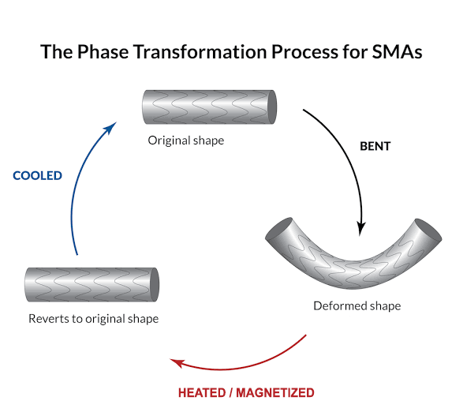

NMIMS Robotics Testbed-1 (NRT-1)
===========

The versatility of MSMAs/FSMAs makes them unique for our use-case. General-purpose Shape Memory Alloys (SMAs) are already used in multiple space applications; proving their worthiness & efficiency over classical sensors & actuators time & time again. Proposed MSMAs allow a new breed of space equipment — imagine a chassis that can change its shape, act as a sensor & does not require any real actuator for movement.

With our research, we wish to bring new materials, soft robotics & underactuated robotics and all their benefits in terms of efficiency, cost-effectiveness & versatility to the New Space revolution in India & to ISRO. Further down the line, we also wish to research upcoming soft-robotics applications & attempt to retrofit the same in space-based applications. Based on the results we provide, we also expect future space missions to have improved efficiency, longer fatigue life, and lower costs on switching to MSMAs instead of traditional sensors (like magnetometers) or actuators (like a BLDC) or structural components (like cable nets used for deployment in Cubesats).
