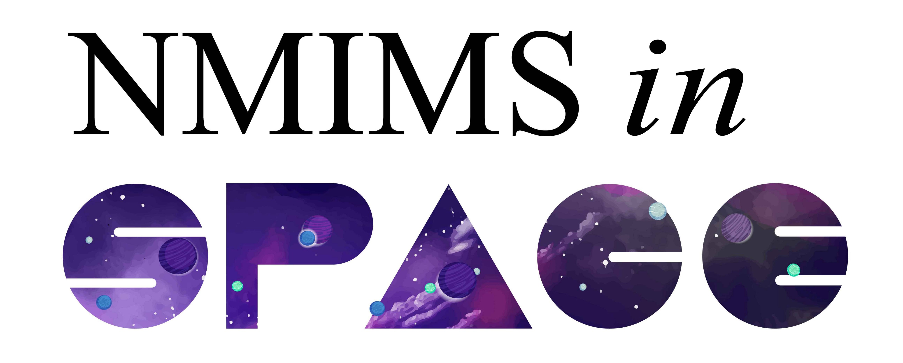

Introduction
============

**NMIMS in Space** is a research project started by an interdisciplinary team of students & alumni from NMIMS MPSTME. Most of us are aspiring researchers who are looking forward to creating our own mark in the research & academia world & are humbled to have accepted this opportunity by Satellize & ISRO.

Our experiment consists of a space-grade PCB that contains samples of Magnetic Shape Memory Alloys or MSMAs/FSMAs (Ferro). These alloys are attached to load cells in order to study the effects of Earth’s latent magnetic field on them; as well as to study the effects of temperature on the material. If our test-bed is successful, it would show that MSMAs can be used in space-grade components in the form of sensors, actuators as well as structural components.

Introduction
  It all started from Saksham's love for diarrhetic, spicy & bloating pseudo-Chinese food over at Chhotu's.

NMIMS Robotics Testbed-1 (NRT-1)
  The Opportunity
    | Satellize - SpaceShare
    | 4th stage of PSLV (PS4)
    | Technical Requirements - specific dimensions; restrictions on sensors/ components
  The Experiment
    The Idea
      | Smart materials?
      | Terfenol-D
      | Space Robotics/ COTS for space usage
      | Designing better components for space

    Design
      | Simulation - Stress Tests?
      | CAD Design
      | Electronics - PCB Design (not the actual design right?)
    Validation
      | 1st prototype implemented
      | Modular software architecture
    Testing
      | Vibration Tests
      | Thermovac
      | ??? Test
    Data
      | Understanding the material stress; transition effects; durability?
      | Basic plots (offline/ground data)
    Results
      | Awaiting launch
    Future Improvements
      | Ground Station
      | Design optimization
      | Other smart materials to look into - NiMnGa

The Team
  Sabka photu
  Sabka data

Press Kit

Contact Us