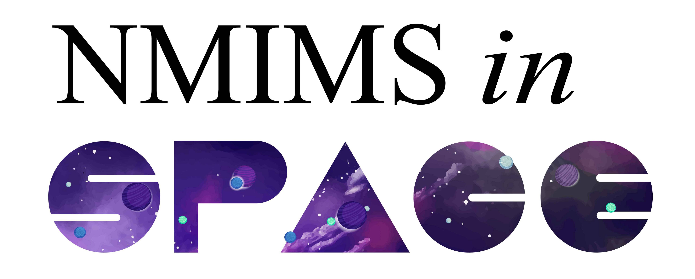

Introduction
============

NMIMS in Space is a research project started by an interdisciplinary team of students & alumni from NMIMS MPSTME. Most of us are aspiring researchers who are looking forward to creating our own mark in the research & academia world & are humbled to have accepted this opportunity by Satellize & ISRO.

Our experiment consists of a space-grade PCB that contains samples of Magnetic Shape Memory Alloys or MSMAs/FSMAs (Ferro). These alloys are attached to load cells in order to study the effects of Earth’s latent magnetic field on them; as well as to study the effects of temperature on the material. If our test-bed is successful, it would show that MSMAs can be used in space-grade components in the form of sensors, actuators as well as structural components.
